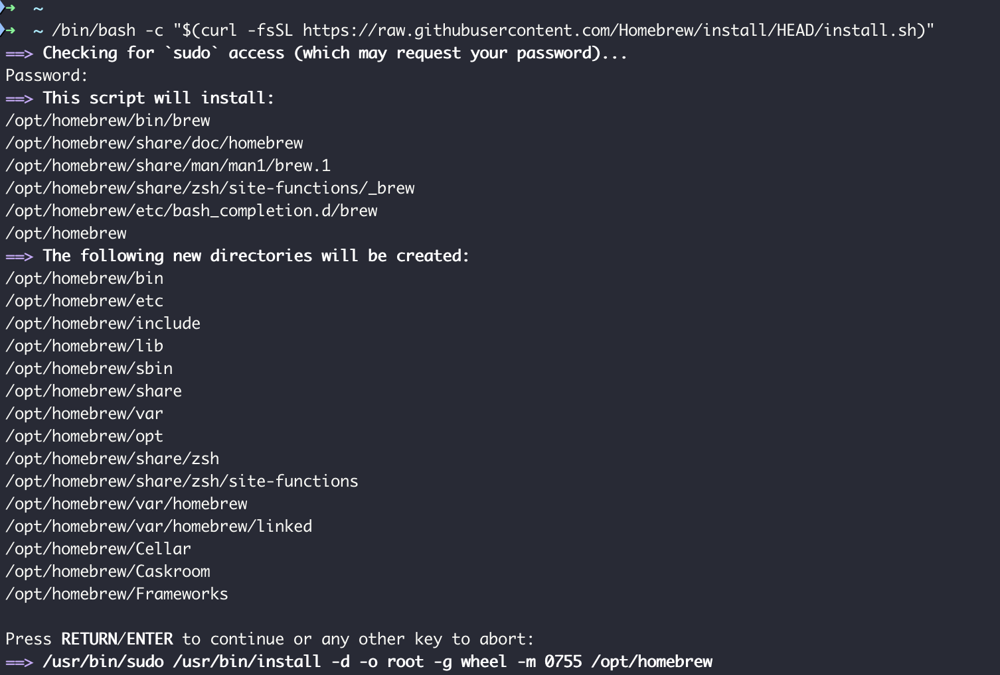
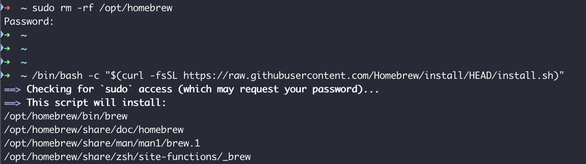
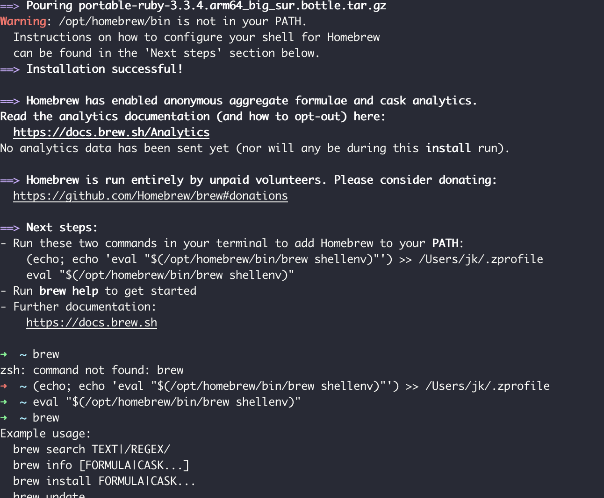
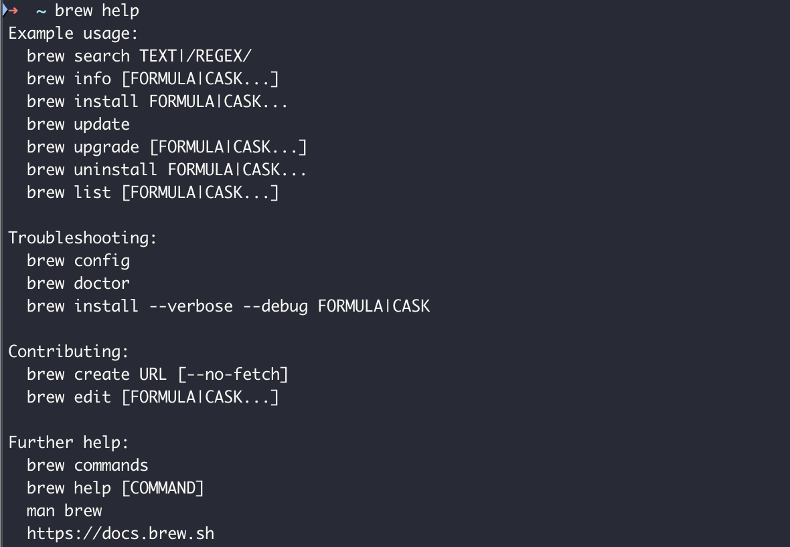

# 安装brew

brew是mac上流行的管理软件，可以快速安装很多好用的工具，比如tree、wget等。

1. 打开ClashPro X的增强模式，否则可能会失败。
2. 进入Homebrew官网，并复制安装命令：

```
https://brew.sh

# 安装命令如下：
/bin/bash -c "$(curl -fsSL https://raw.githubusercontent.com/Homebrew/install/HEAD/install.sh)"
```


3. 打开terminal终端，复制并执行：



等待它执行完成，可能需要一点时间。If failed, please try again.



按照指导完成设置变量：



查看帮助文档：brew help



至此，homebrew安装全部完成。


## 使用brew安装一些常用命令工具

linux下非常好用的命令行工具，基本都可以找到：

```
brew install tree
brew install wget

```

很多好用的工具都可以被一键安装，实在是太方便了。

