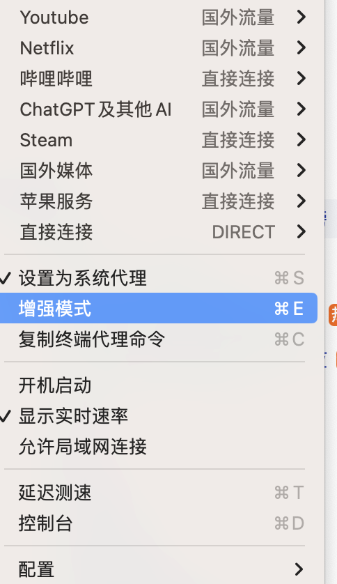
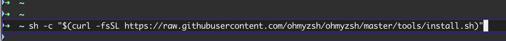
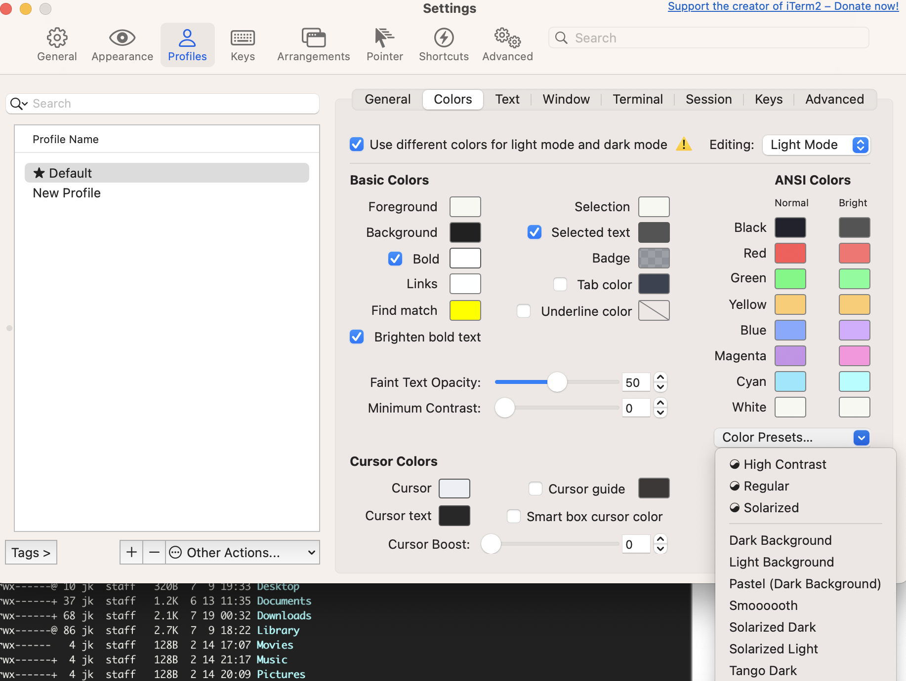
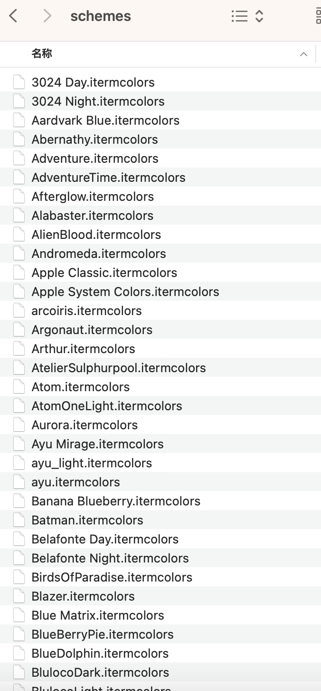
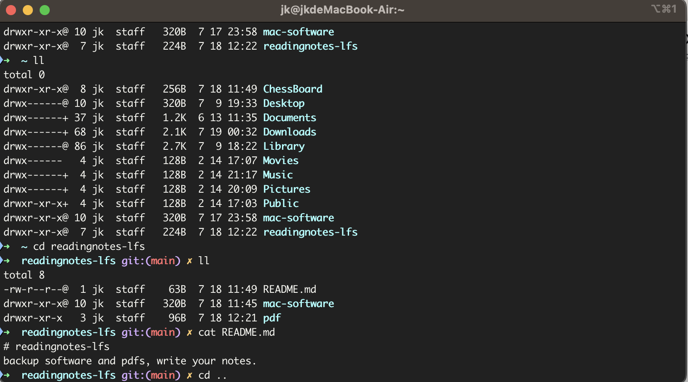

## 安装iterm2

打开vpn，直接从官网下载dmg安装包后安装。完成后会发现界面不好看，需要优化。


## 安装oh-my-zsh

1. 打开ClashX Pro，并启动增强模式（不启用增强模式会爆403错误）。如下方式启动：



2. 登陆oh-my-zsh官网

   ```
   https://ohmyz.sh/#install
   ```

3. 复制oh-my-zsh官网上的curl命令直接一键安装和下载：



3. 安装喜欢的主题：

   Iterm2 -> Settings -> Profiles -> Colors, 选择自己喜欢的一个。

   

如果都不喜欢，还可以上github下载更丰富的主题：

```
https://github.com/mbadolato/iTerm2-Color-Schemes.git
```

下载完iTerm2-Color-Schemes.git后，schemes目录下就是颜色模版。

Iterm2 -> Settings -> Profiles -> Colors -> Color Presets，有import按钮，可以选择喜欢的import进去。



我自己的效果是这样的：



使用的主题是Dracula+，效果如上图。

其实很多效果都差不多，选择自己合适的就可以。


