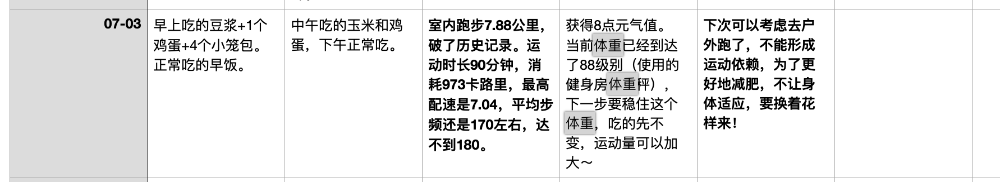

## 当前的减肥困境

今天是2024年7月31日，7月份的最后一天。

我今天的体重还是89kg，而我7月底的目标体重是85kg。我失败了！

而当前的89公斤体重，我是6月份就已经达到了！

也就是说，整个7月份减肥没有任何的进展！

> 仔细查看了一下每日更新的减肥运动饮食日志，发现7月3号的时候体重曾经达到了88公斤，同一个体重秤的数据。

以上是记录截图，千真万确！

## 挫败感

减肥计划没有达成，确实是很有挫败感。

情绪也很差，心情很不好，减肥也没了动力。

甚至都有点怀疑，减肥到85kg是不是个不能达成的目标？

我是不是个loser？减肥最开始的幸福感和快乐是不是永久的丢失了？

想当时，3月份开始减肥的时候，我的体重是98kg，很快几个月减到了89kg，成绩还是很大的。身材变好了，肚子变小了，腰围也减少了，真的是很有成就感。

## 下一步怎么办？

脑子很乱，现在减肥遇到了瓶颈期。如果不能突破，我的减肥计划就无法进行下去了。

想来想去，暂时想到了以下几个思路：

1. 继续看科学健康减肥视频，学习减肥知识
2. 更加科学地控制饮食
3. 更加科学地运动
4. 更加科学地对抗饥饿感引起的情绪低落

