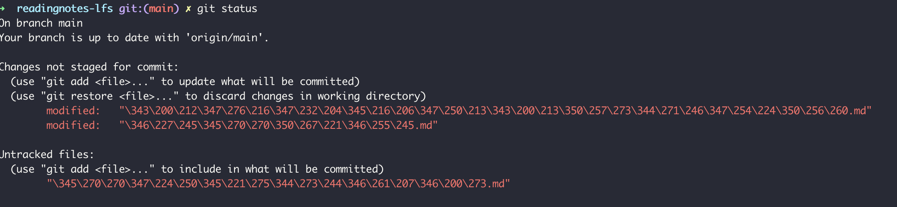

## 中文显示

如果在terminal上使用git命令时，中文显示有问题，如下图：



这种乱码对我们的代码管理、协作与维护带来了很大的困扰。

解决办法：

```
# 查看git配置
git config --list
```

此命令可以列出git的全部配置信息，包括用户信息、默认编辑器等。在其中，我们需要关注以下两个配置项：

```
core.quotepath=false
core.assumeunicode=true
```

如果以上两个配置项的值不是上述的值（或者没有），则需要使用以下命令来更改这两个值：

```
git config --global core.quotepath false
git config --global core.assumeunicode true

```

现在，就能在git终端正常显示中文了：

