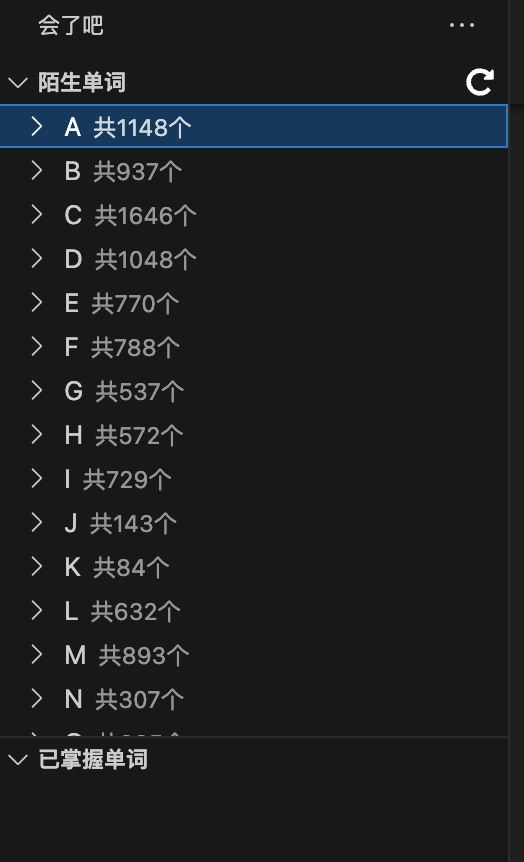
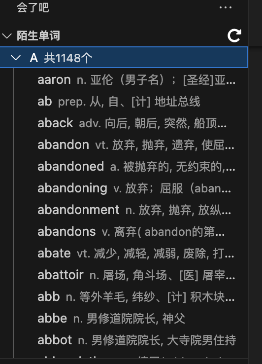
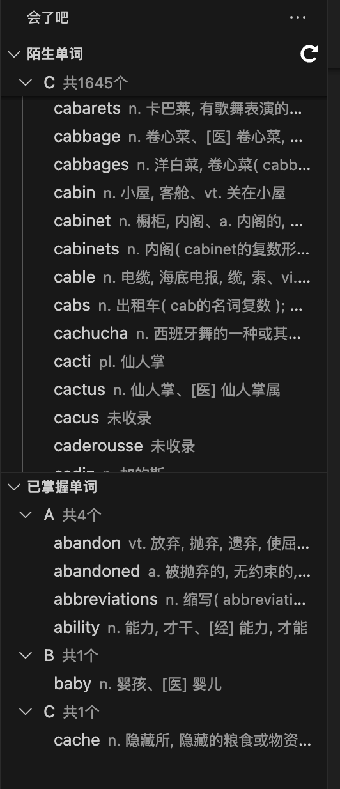
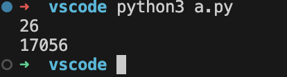
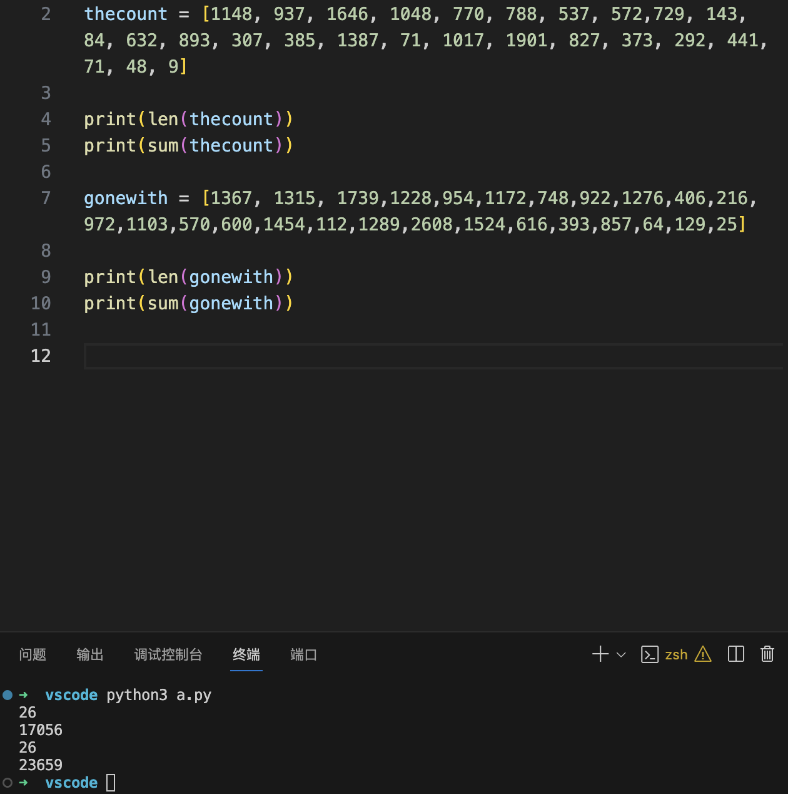

# 英语学习

## 查词典

勤查词典是提高英语的不二法门。

### 纸质词典

最好是有一本《牛津高阶英汉双解词典》纸质版在手。必要时，方便时，就打开翻一番，绝对有不一样的收获。

另外，需要注意的是：**不要迷信全英文词典**。所谓的全英文词典指的是native speaker使用的词典，里面只有英文解释，没有中文解释。网上很多自以为是的英语经验传授者往往喜欢强调，只有用这种全英文词典才能模拟native的学习状态，才能更好地成功。这是错误的，并且大错特错，你自己不是native，如果用全英文词典可能压根读不懂释义，也就失去了查词典的意义。中文也是必须的，没有中文的注解你对英文的理解很有可能是南辕北辙的。

> 李笑来也有相同的观点，这种纯属某种难以言说的“精神洁癖”，对于外文能力的提高毫无用处。

还有，这里有另外一个论点：“一个人的第二语言能力不可能超过第一语言的能力”，仔细想想这句话，即使是英语博士生毕业，同声口译专家也不例外。所以，如果能提高第一语言，你的第二语言的上限同时也会提高。

> 很难想象一个中文文盲，最终成为了英语熟练使用者。这是不可能的。

### 使用词库

词库其实比你用什么电子词典更重要，因为很多词库都是商业词典的电子版，都是要收费的。而且，很多词库都很大，下载也不是很方便。

这里保存一下Mdict词库下载地址：

```
https://mdx.mdict.org
```

喜欢的词库可以从这里下载。

### 欧路词典

一个还在持续更新的词典app，要下载支持自定义词库的版本使用。在不能联网的状态下，还是挺好用的。虽然没有网络的场景真的是越来越少了。


## vscode学习的一个新思路

vscode是当下最牛逼的文本编辑器、文本查看器，对于TXT格式的英文文本来说，是个很合适的阅读器。

它有一系列插件，其中有个插件名字叫“会了吧”，看这个调皮的名字应该是个中国人开发的。

这个插件可以读取当下目录下所有的英文文本，统计出所有英语单词。并且按照字典序列排序。






点击每个单词还可以发音，后面还有一个对号。点击后，就会移动到“已掌握单词”的列表里。



如上图，每次一点击，“陌生单词”就会少一个，“已掌握单词”就会多一个。

我还统计了一下这本《基督山伯爵》（The Count of Monte Cristo）(Penguin Classics)的单词个数。如下：

```python
new_words = [1148, 937, 1646, 1048, 770, 788, 537, 572,729, 143, 84, 632, 893, 307, 385, 1387, 71, 1017, 1901, 827, 373, 292, 441, 71, 48, 9]

print(len(new_words))
print(sum(new_words))
```

结果为：



上面的结果表示一共26个字母，一共使用了17056个英语单词。这在一定程度上说明了这本书的阅读难度。

再统计一本《飘》，统计结果如下：



从这里可以看出来，《飘》（gone with the wind）这本书使用的单词数是23659，比基督山的17056要多6000个单词。一定程度上说明这本书要比基督山更难读一些。

> 这里，我想说，计算机、统计学真的很好用！

